# AWS SDK Demo
This is a java Springboot application with a simple Thymeleaf UI and jquery demonstrating the use of AWS with the AWS SDK.

See [here](https://docs.aws.amazon.com/sdk-for-java/latest/developer-guide/get-started.html) for Getting Started guide.

Most backend code are derived from examples [here](https://github.com/awsdocs/aws-doc-sdk-examples/tree/main/java/example_code).

See pom.xml for dependencies needed.

## Setup
You will need an AWS account and a user created for the account. There are several ways to authenticate. See [here](https://docs.aws.amazon.com/sdk-for-java/latest/developer-guide/get-started-auth.html). One way is to download the Access Key and Secret Key for your user and [set up environment variables](https://docs.aws.amazon.com/sdkref/latest/guide/environment-variables.html). Your user needs to be setup with access to various AWS resources.

In the Constants.java file I have a constant named REGION. Change it to whatever your region may be.

Once you have the Springboot project running, launch with
[http://localhost:5000](http://localhost:5000)

## Screenshots
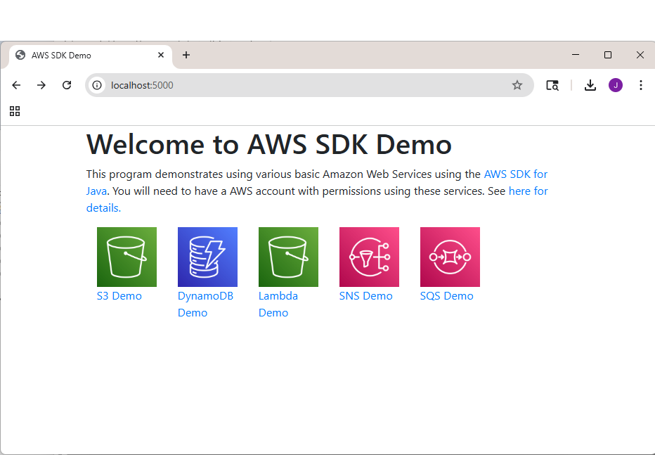
 
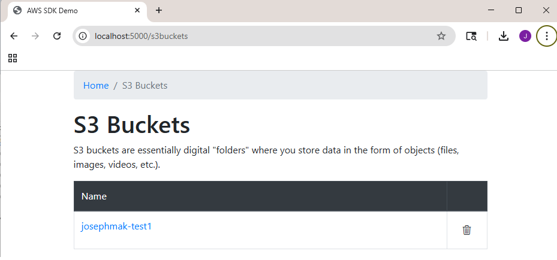
 
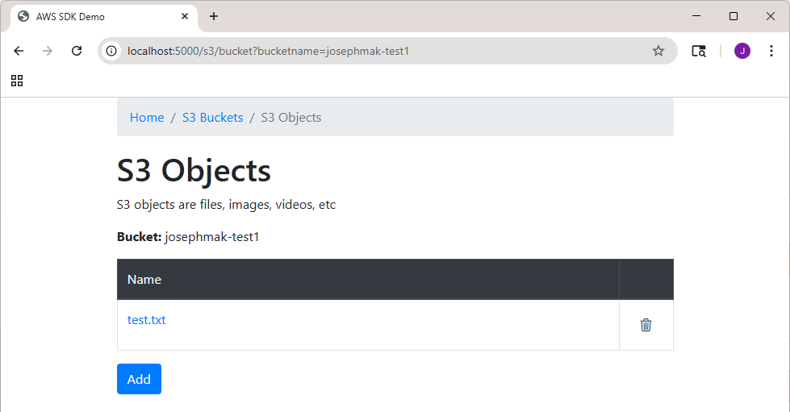
 
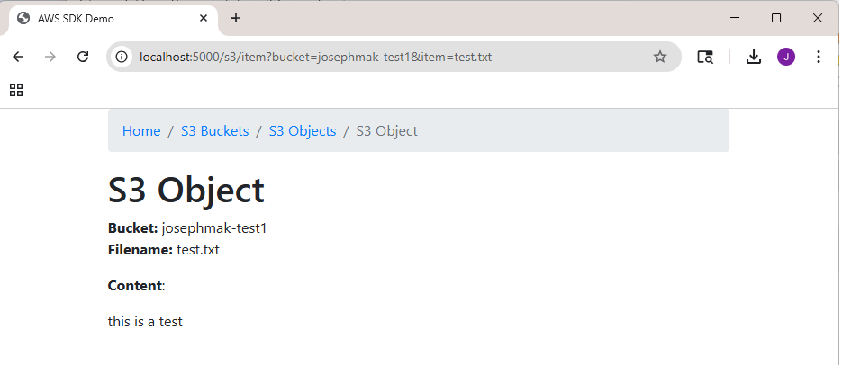
 
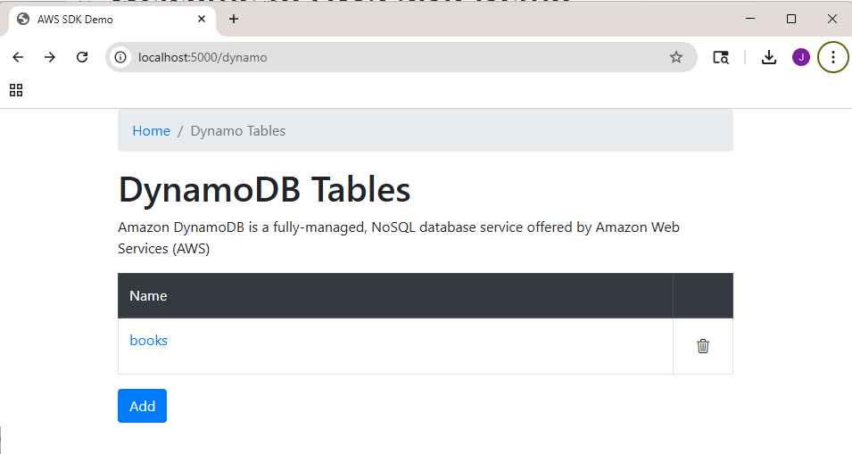
 
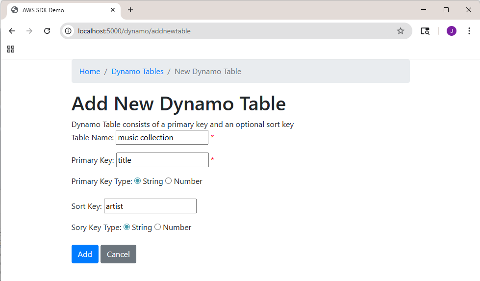
 
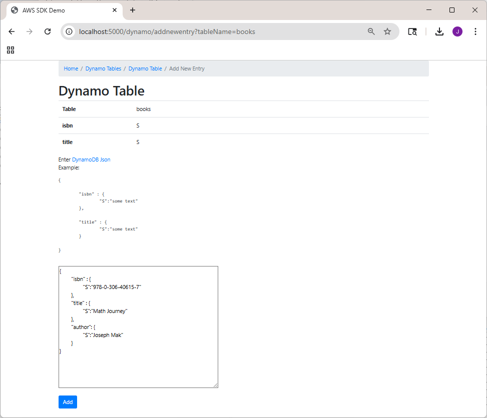
 
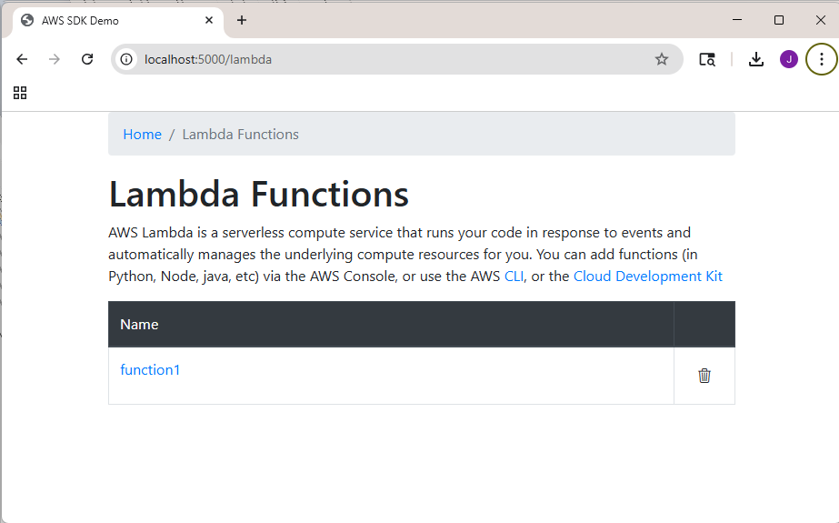
 
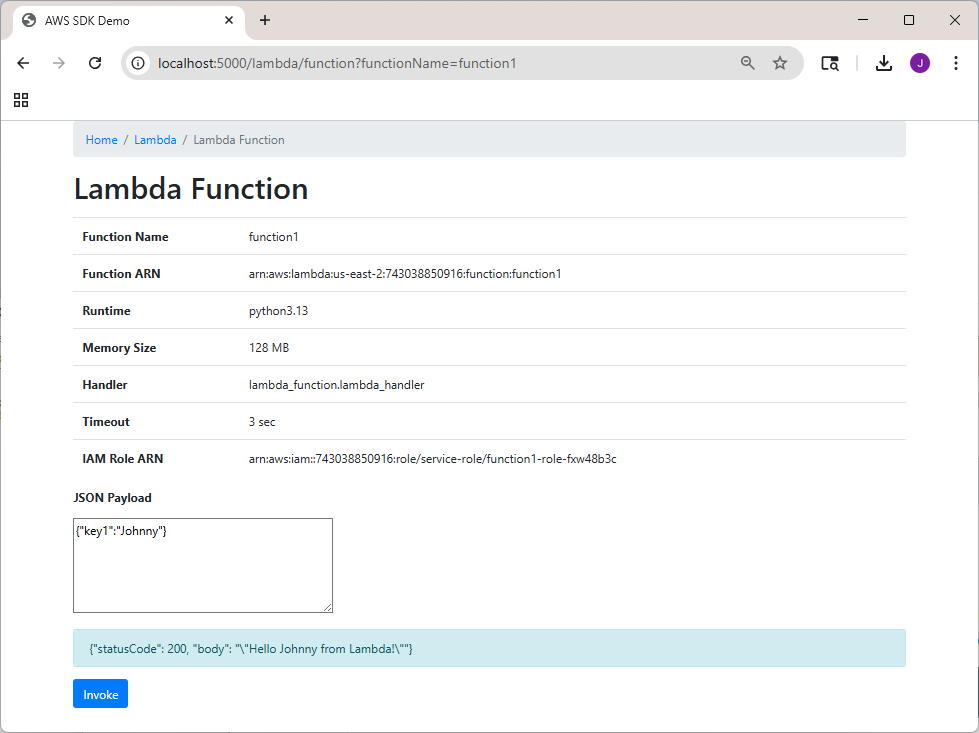
 
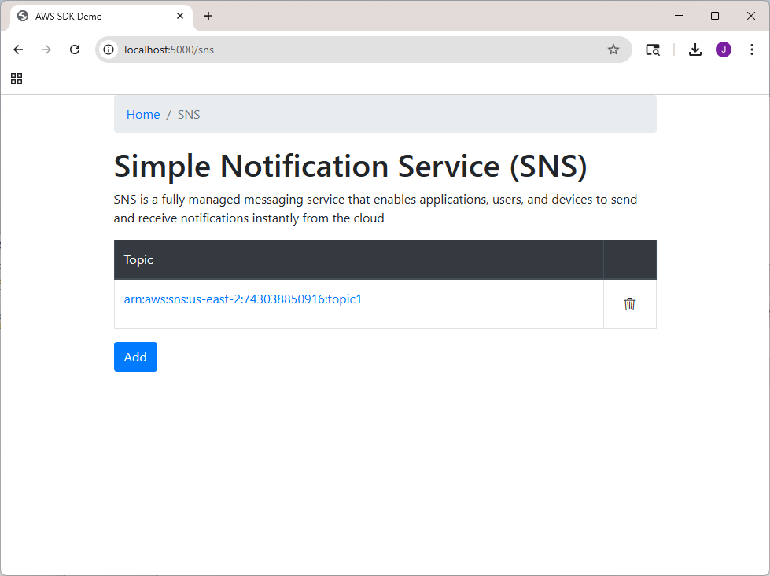
 
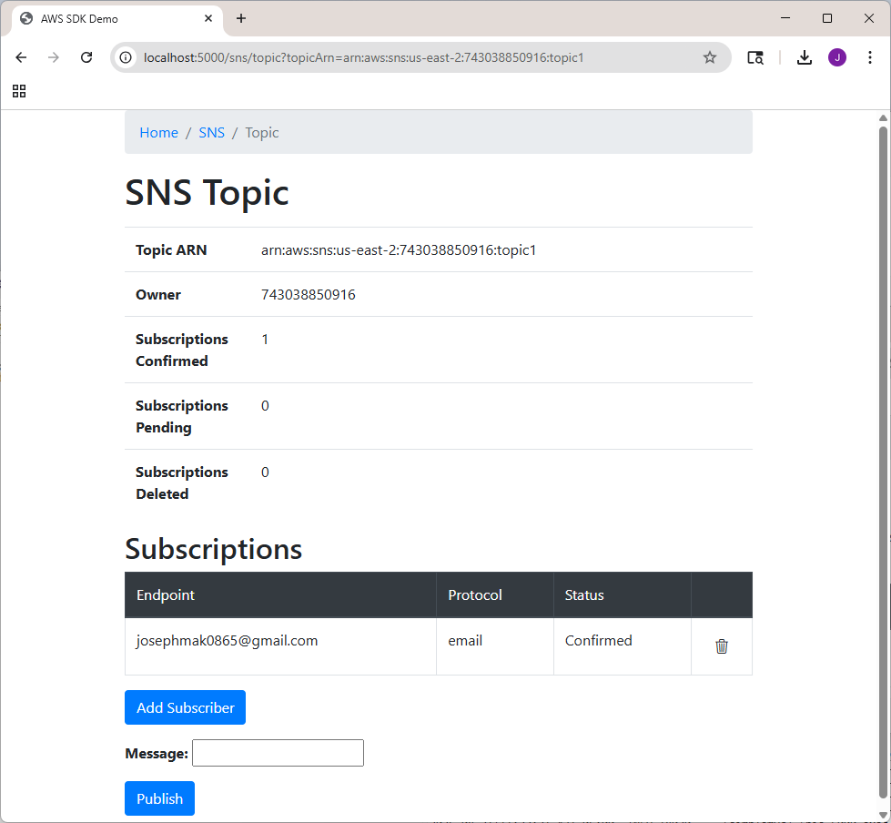
 
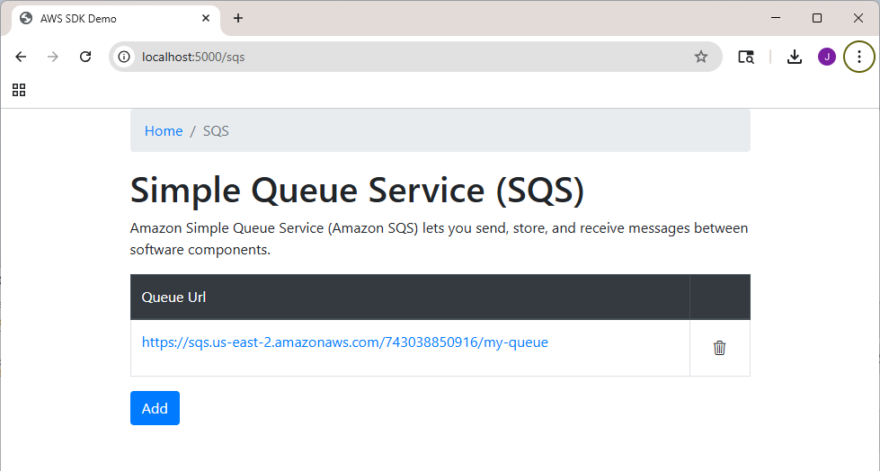
 
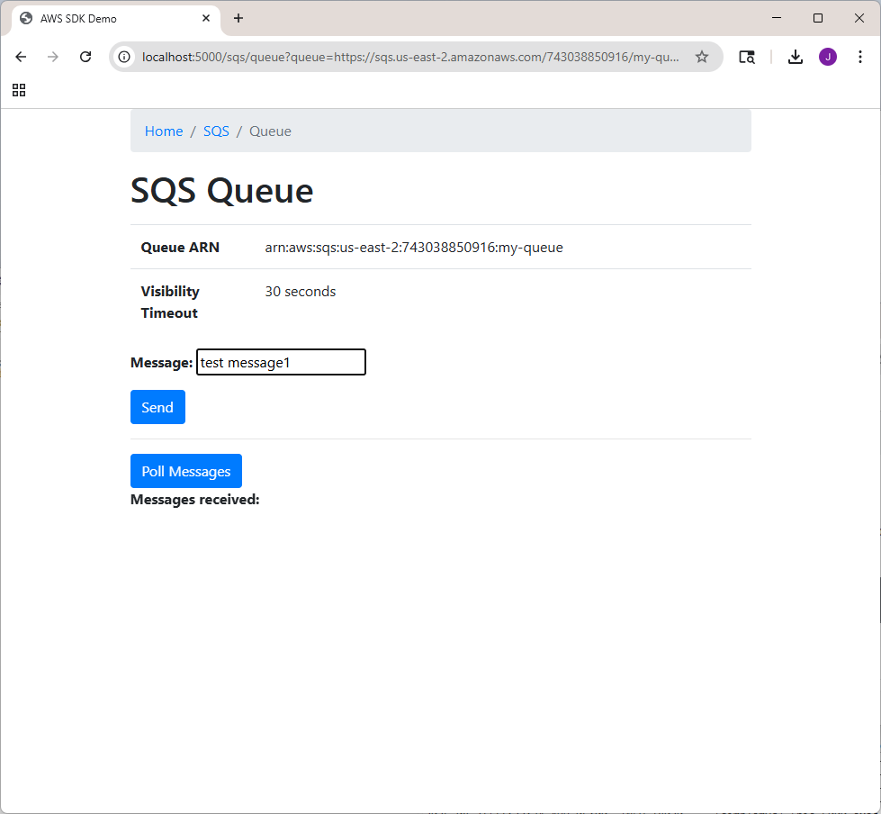
